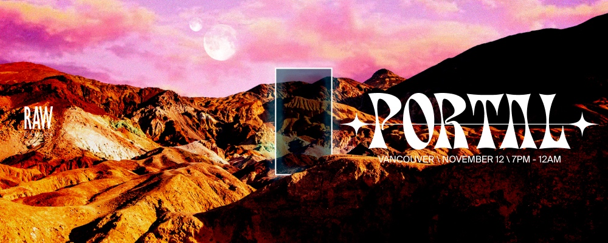

# RAW Vancouver PORTAL 2022

This repo contains the [3D Printed Brackets](#3D-Printed-Brackets), the [Electronics](#Electronics) and the [Software](#Software) that is under development for [RAW Vancouver: Portal](https://rawartists.com/vancouver) eta `2022-11-12`.

[](https://rawartists.com/vancouver)

## 3D Printed Brackets

## Electronics

## Software

Install [`abcli`](https://github.com/kamangir/awesome-bash-cli) on a Mac or Linux machine. Then open a terminal and type in,

```bash
abcli git clone rv22 install
```