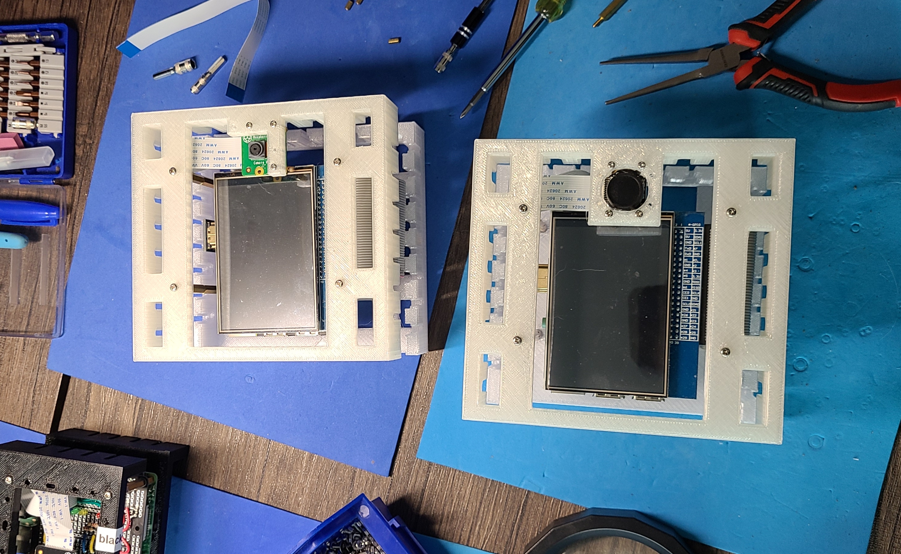

# RAW Vancouver PORTAL 2022

[](https://github.com/kamangir/blue-bracket/blob/main/designs/portal.md)

To install the software, first install [`abcli`](https://github.com/kamangir/awesome-bash-cli) on a Mac or Linux machine, then open a terminal and type in,

```bash
abcli git clone rv22 install
```

See [blue brackets/portal](https://github.com/kamangir/blue-bracket/blob/main/designs/portal.md) for hardware details.


[](https://rawartists.com/vancouver/portal)